# Audio in Fungus games

Almost every game benefits from some sound! Often we categories audio clips into three kinds:

1. Music
1. Sound effects
1. Speech

Fungus provides straightforward ways to include all 3 kinds of audio clip in your game, using the techniques presented here.

<!-- **************************************** -->
## Sources of free to use audio clips and music
Before you can **add** audio clips to a game you need to get some audio clips. Here are some sources of audio clips to use when learning about audio in Fungus, in case you don't have some of your own to hand.

The following are some good places online to fine music and sound effects for games. Some are free for any use (including commerical), some are just free for personal use. As always, check the licence of media assets before using them for any commerical products ...

- [Freesound.org]
- lots of creative commons and royalty free sounds at [SoundBible.com]
- a great list of audio sources in peoples answers to questions at [Answers.unity3d] and [StackOverflow.com]
- mixture of free and paid music sources at [PixelProspector.com]

You'll find a range of audio clips included inside the Fungus Examples folders:
<br>
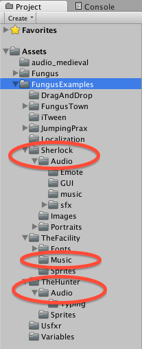
<br>

## Adding audio assets to your project
Once you have some audio clips on your computer, you need to import them into your Unity project.

###Method 1 (menu)
You can do this one clip at a time, by choosing menu: ```Assets | Import New Asset...``` and navigating to and selecting each clip.

###Method 2 (drag-drop)
Alternatively you can **drag** files or entire folders into your Unity Project window, and Unity will make a copy of, and then import the dragged files:

<br>
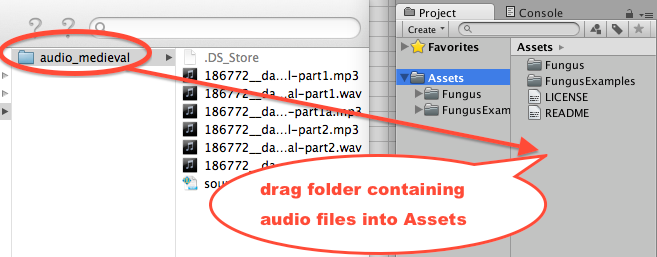
<br>


<!-- **************************************** -->
## Three ways to work with audio in Fungus games
There are 3 main ways to work with audio in Fungus games. These are the Audio commands, the Say command, and gameObjects containing Unity Audio Source components. All three are discussed below:
<br>
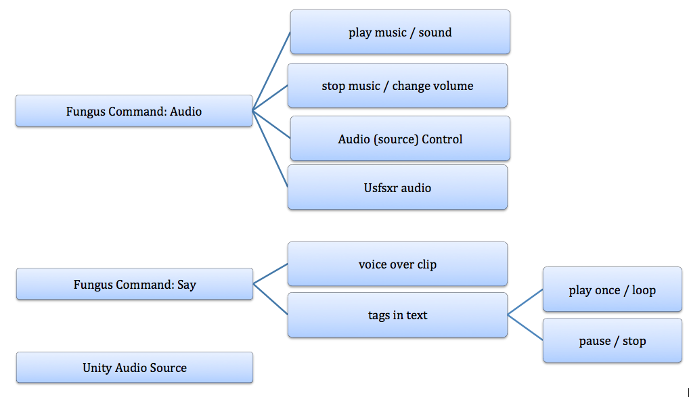
<br>


<!-- **************************************** -->
## List of Fungus audio commands
The range of audio **Commands** you can add to a Block are as follows:
<br>
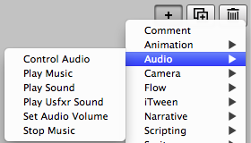
<br>

Also you can declare an audio clip that contains the speech voiceover to correspond to text displayed with a **Say** command:
<br>
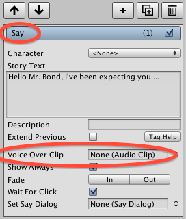
<br>

<!-- **************************************** -->
## Play Music command
Music sound clips loop, so they are restarted once they have finished playing. Often the first Command in a Block is a **Play Music** Command. Add music to a Block as follows:

1. (if you have not already done so: Create a new scene, add a Fungus Flowchart to the scene, and select the Block in the Flowchart).

1. Add a Play Music Command to the current Block by clicking the Add Command (plus-sign "+" button) in the Inspector, and then choosing menu: ```Audio | Play Music```.

1. Ensure the Play Music command is selected (green highlight) in the top of the Inspector, and then drag the desired music clip file into the "Music Clip" property in the bottom half of the Inspector:
<br>

<br>
<br>

1. Change the volume as desired
<br>(the default is 1, values are between 0.0 and 1.0, representing percentages of volume from 0% - 100%).

1. Play your scene - the music clip should play, and keep looping.

NOTE: If you wish to start playing the music clip from a known time-point (rather than from the beginning), then enter the desired timepoint in the Inspector property "At Time" for your Play Music command.

<!-- **************************************** -->
## Play Sound command
The Fungus Play Sound Command will play a stated audio clip once. With your Flowchart Block selected, click the Add Command button in the Inspector and choose menu: ```Audio | Play Sound```. Drag in a sound effect (we chose the BearRoad sound from the Hunter example):
<br>
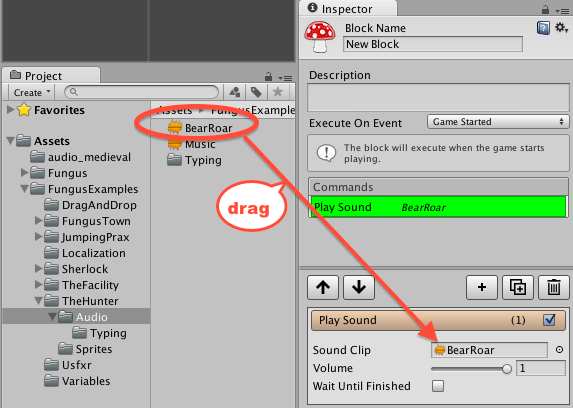
<br>

Play the scene, you should hear your sound effect play once.

Note. The default Fungus setting is for the sound effect to start playing, and while it is playing the next Command in the Block will start executing. However, you if you check the "Wait Until Finished" checkbox, then Fungus will wait until the sound effect has finished playing, before moving on to execute the next Command in the block:
<br>

<br>

<!-- **************************************** -->
## Set Audio Volume command

The default volume for music being played is 1 (100%). However, we can change this easily with the Set Audio Volume command. Do the following:

1. (if you have not already done so: Create a new scene, add a Fungus Flowchart to the scene, and select the Block in the Flowchart).

1. Rename this Block "Play Music".

1. Add a Play Music Command to the current Block, then drag the desired music clip file into the "Music Clip" property in the bottom half of the Inspector:
<br>
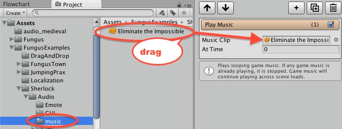
<br>
<br>

1. If you play the scene now, the music will play at full volume (1 = 100%).

1. Now create a second Block in the Flowchart window named "quieter".
<br>
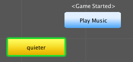
<br>
<br>

1. Add to this new Block a Set Audio Volume Command.
<br>
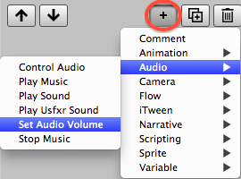
<br>
<br>

1. In the properties of the Set Audio Volume Command set the volume to 0.25 (25%).
<br>
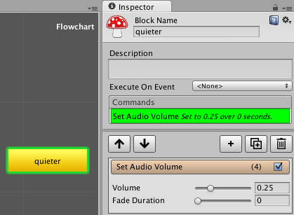
<br>
<br>

1. Select the "Play Music" block, and add a Menu command by clicking the plus-sign add Command button in the Inspector and then choosing menu: ```Narrative | Menu```.
<br>
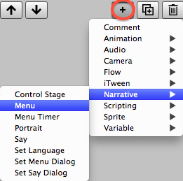
<br>
<br>

1. Set the Text Property to "Make Quieter" and the Target Block to Block "Quieter":
<br>
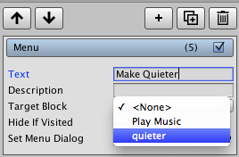
<br>
<br>

1. In the Flowchart window you should now see a green arrow, showing that a Command in Block "Play Music" passes control to Block "quieter":
<br>
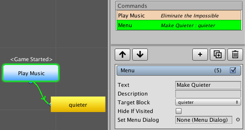
<br>
<br>

1. When you run the scene, the music will start playing at full volumne, then when y ou click the "Make Quieter" button, controll will pass to the "quieter" block, and you'll hear the music become much quieter after the Set Audio Volume Command has been executed with a value of 25% (0.25):
<br>

<br>
<br>


## The 3 Unity audio concepts
Unity has 3 different kinds of Audio 'object', that it is worth understanding when working with audio in Fungus (or any other) Unity project:

1. Audio Clip
1. Audio Listener
1. Audio Source

### Unity Audio Clip
Unity uses the term Audio "Clip" to refer to the physical sound files (.mp3, .wav, .ogg etc.) that are stored in your Project folder. It is these Audio Clip files that you drag and drop into the "Music Clip" and "Sound Clip" properties in the Inspector Window, when creating Play Music and Play Sound Commands in a Fungus Block.

### Unity Audio "Listener"
Basically, if you want sound to be played there must be an Audio Listener component inside one of the gameObjects in your scene. The Main Camera of a scene has one by default, so in most cases you just leave this alone and can rest assured that you have an Audio Listener.

If a scene has no Audio Listener in any gameObject, then no audio will be heard by the user of the game, regardless of how many music and sound clips might be playing.

Sometimes you may add gameObjects to your scene that contain another Audio Listener component. In this case, Unity will present a warnig message stating that more than 1 Audio Listener is present in the scene. If you see such a message, then its best to resolve this problem by disabling all but one Audio Listener...

If you are working with a 3D game, and/or you wish to present a sophisticated stereo sound experience for your user, then you may need to learn about 3D audio. In such games the 3D "position" of the gameObject containing the Audio Listener becomes important - but don't worry about this if you are just getting started with audio in Fungus. For 3D effects the Audio Listener is like an "electronic ear", so its location determines things like how loud a sound is played (distance from "ear") and left-right stereo balance (which "side" audio is to the "ear") etc.

### Unity Audio Source
In Unity the link between an Audio Clip (music/sound) file that we wish to be played, and the Audio Listener in the scene is a Unity Audio Source component of a gameObject. However, in most cases Fungus creates one of these if neeeded, so we don't need to worry about them!

However, for sophisticated control of music and sound and speech in your game there is the facility to make Fungus have detailed control of Unity Audio Sources. It is an Audio Source component that controls how and when and which part of an audio clip is playing (and whether it should loop or not), and whether it is playing or paused, and when resuming should continue from where paused or restart. The volume of a playing clip can also be controlled by properties of an Audio Source.

Learn more about audio in Unity at the [Unity Manual Audio Page].
<!-- **************************************** -->
## Control Audio command

The Fungus Audio Commands cover all common music and sound effect actions, for specialist audio work you may need to access the raw (and complicated) power of Unity audio. The Fungus Command "Control Audio" lets Fungus Blocks communicate directly with Unity Audio Source components in any gameObject in the current scene, so your wizard audio team member can do what they need to do with the Unity toolkit, and you can still control playing / looping / volume etc. of the audio in those complex gameObjects.

The Control Audio Command offers five actions that can be communicated to Unity Audio Source components:
<br>
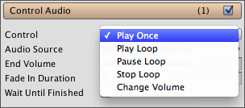
<br>
<br>

We'll learn about this with a simple Unity gameObject that plays a bear sound two times, first at full volume and then reduces the volume before playing a second time, using three "Control Audio" Fungus Commands. Do the following:

1. (setup) If you have not already done so: Create a new scene, add a Fungus Flowchart to the scene, and select the Block in the Flowchart.

1. Rename this Block "Control Audio".

1. In the Hierarchy Window create a new Empty gameObject, choose menu: ```Create | Create Empty```:
<br>

<br>
<br>

1. Rename this new empty gameObject "GameObject - bear sound" (or whatever sound name makes sense in your project).

1. Locate your desired audio clip file in the Project window, and (with "GameObject - bear sound" selected), drag a reference to the audio clip from the Project window into the Inspector:
<br>
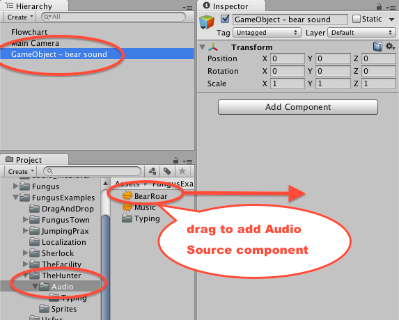
<br>
<br>

1. An Audio Source component should now be added in the Inspector to "GameObject - bear sound". Un-check the Play On Awake property in the Inspector (to stop this sound from playing as soon as the scene begins - **we** want to be in control of this Audio Source object...):
<br>
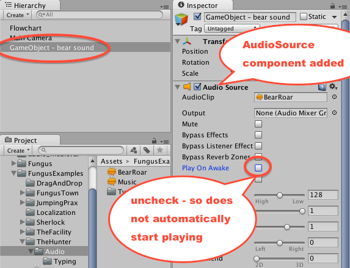
<br>
<br>

1. With your Flowchart Block selected, click the Add Command button in the Inspector and choose menu: ```Audio | Control Audio```.
<br>
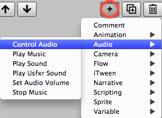
<br>
<br>

1. Drag the  "GameObject - bear sound" gameObject from the Hierarchy into the Audio Source property in the Inspector, and select the Wait Until Finished checkbox (so Fungus will wait for the sound to finish playing before moving on):
<br>

<br>
<br>

1. Note that the default Control action for a Control Audio Command is "Play Once" - we'll leave this property unchanged, since we want our bear sound inside our gameObject to be played once.

1. If you run the scene now, you'll hear the bear sound play once at full volume.

1. Since all three of the Control Audio commands we need use a link to "GameObject - bear sound" the fastest workflow is to **duplicate** each Command, and just change the bits we need. So duplicate your Control Audio command by clicking the Duplicate Command button:
<br>
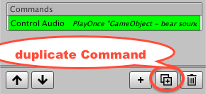
<br>
<br>

1. In the newly copied command, change the Command action to Change Volume, and choose a volume of 0.25 (25%):
<br>
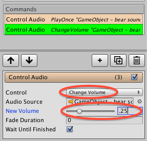
<br>
<br>

1. Once again, make a duplicate of the first Control Audio Command (that Plays the sound). Drag this new Command to be last in the sequence of commands.
<br>

<br>
<br>

1. Now when you play the scene, first the bear sound linked to in the Audio Source component of gameObject "GameObject - bear sound"  should play at full volume, then (after having its volume reduced to 25%) it should play a second time at a much reduced volume.

<!-- **************************************** -->
## Audio Tags (link to Say command docs)

Since often dialog authors will know just what sound effects or music they wish to associate with their characters utterances, Fungus allows audio-related 'tags' to be embedded in the text of Say Commands. There are four audio related tags:

	{audio=AudioObjectName} Play Audio Once
	{audioloop=AudioObjectName} Play Audio Loop
	{audiopause=AudioObjectName} Pause Audio
	{audiostop=AudioObjectName} Stop Audio

Using tags like this make it important to carefully **name** the gameObjects in the Hierarchy window. To explore how to control sounds in gammeObjects do the following:

1. (setup) If you have not already done so: Create a new scene, add a Fungus Flowchart to the scene, and select the Block in the Flowchart.

1. Rename this Block "Say audio tags".

1. In the Hierarchy Window create a new Empty gameObject, choose menu: ```Create | Create Empty```:
<br>

<br>
<br>

1. Rename this new empty gameObject "audioBearRoar", or whatever sound name makes sense in your project, but avoid spaces in the name of this game object.

1. Locate your desired audio clip file in the Project window, and (with "audioBearRoar" selected), drag a reference to the audio clip from the Project window into the Inspector.

1. Un-check the Play On Awake property in the Inspector for the Audio Source component (to stop this sound from playing as soon as the scene begins - **we** want to be in control of this Audio Source object...):

1. With your Flowchart Block selected, click the Add Command button in the Inspector and choose menu: ```Narrative | Say```. Enter the following for the Story Text property of this Say Command "... and then the bear roared loudly {audio=audioBearRoar}":
<br>
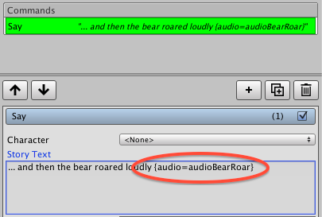
<br>
<br>

1. Run your scene - the bear sound will play after the text has been displayed:
<br>

<br>
<br>


[Freesound.org]: http://www.freesound.org/
[Answers.unity3d]: http://answers.unity3d.com/questions/7743/where-can-i-find-music-or-sound-effects-for-my-gam.html
[SoundBible.com]: http://soundbible.com/royalty-free-sounds-1.html
[StackOverflow.com]: http://stackoverflow.com/questions/1210286/where-can-i-find-free-sound-effects-for-a-game
[PixelProspector.com]: http://www.pixelprospector.com/the-big-list-of-royalty-free-music-and-sounds-free-edition/
[Unity Manual Audio Page]: http://docs.unity3d.com/Manual/AudioOverview.html