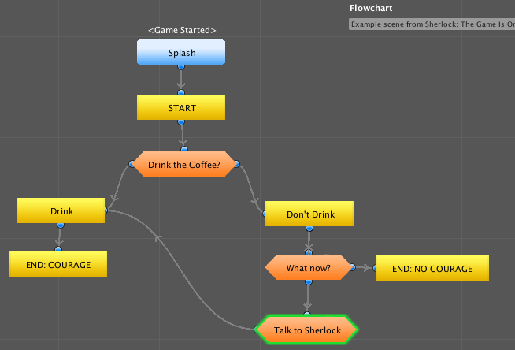
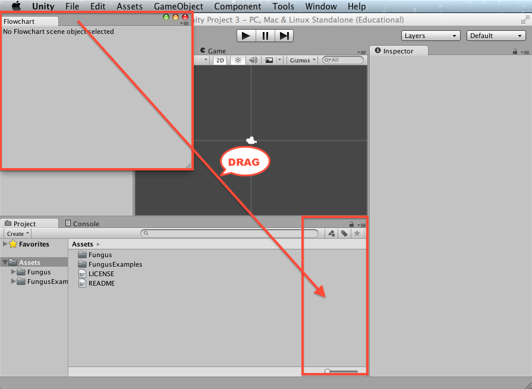
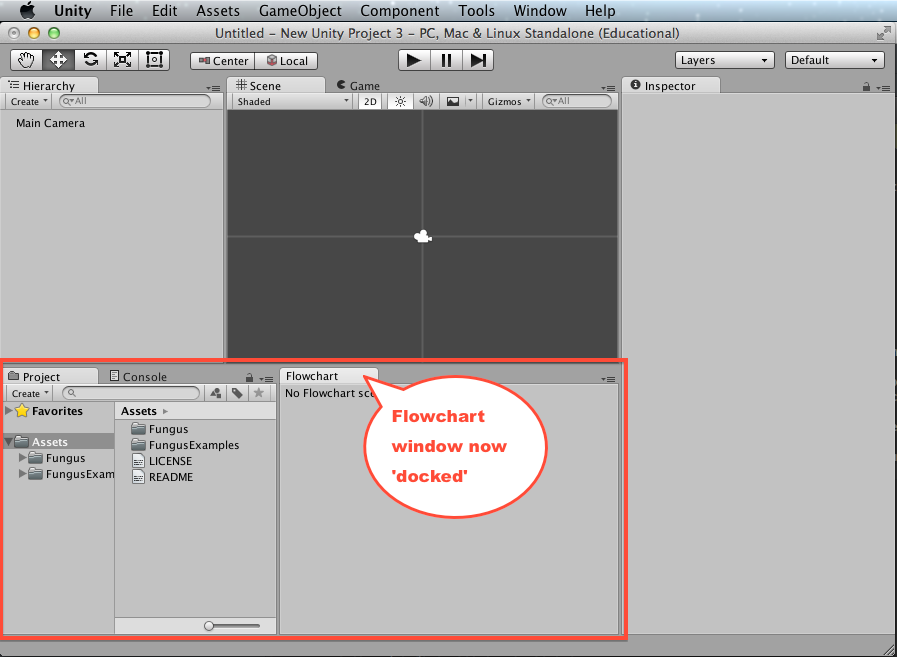
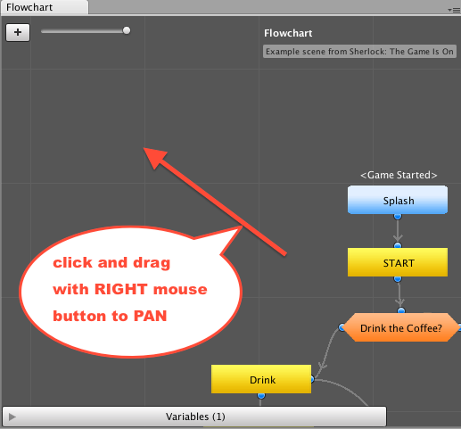
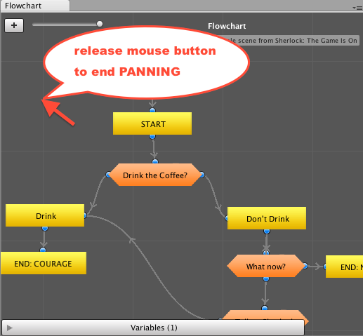
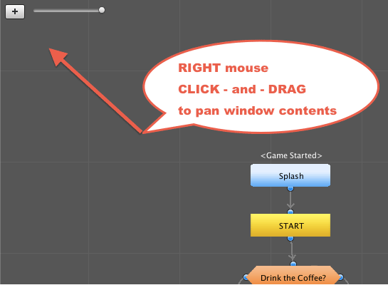
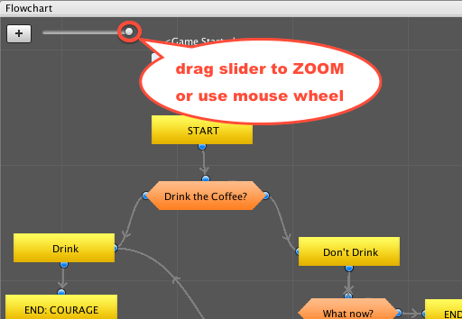
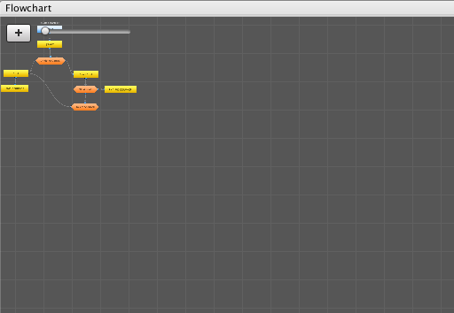

# Fungus Fundamentals - Flowcharts and Blocks
A fundamental concept of Fungus is the **Flowchart**. Scenes can contain multiple

<!-- **************************************************** -->
## What is a Flowchart?

A Fungus **Flowchart** where all your Fungus Commands live in their Blocks. A Unity scene can contain multiple Flowcharts, and commands can be executing simultaneously in different Flowcharts. However, for many games it is sufficient for one Block in one Flowcart to be executing at any one time.

Here is an example of a Fungus Flowchart:
<br>

<br>


<!-- **************************************************** -->
## Opening and docking the Flowchart window
You'll need the Fungus Flowchart window when working with Fungus. Open and dock this window somewhere handy by following these steps:

1. Choose menu: ``Tools | Fungus | Flowchart Window``
<br>

<br>
<br>

2. Drag-and-drop the Flowchart window to the location you wish to dock it:
<br>

<br>
<br>

3. The Flowchart window is now docked and part of your Unity window layout:
<br>



<!-- **************************************************** -->
## Creating a Flowchart
To create a Fungus Flowchart do the following:

1. Choose menu: ```Tools | Fungus | Create Flowchart```
<br>

<br>
<br>

2. A new **Flowchart** gameObject should appear in the Hierarchy window.
<br>

<br>
<br>

3. Select the **Flowchart** gameObject in the Hierarchy window, and you'll see the **Flowchart's** properties in the Inspector Window:
<br>

<br>
<br>

4. If you have not already displayed the Flowchart Window, you can do so by clicking the Flowchart Window button in the Inspector.

5. As you can see, when a new Flowchat is created a single command Block named "New Block" is automatically created, with the Event handler "Game Started" (so it will start executing Fungus commands as soon as the scene goes into **Play Mode**).


<!-- **************************************************** -->
## Flowchart description

<!-- **************************************************** -->
## Panning the Flowchart window
Panning means moving the contents of the Flowchart window as if they are on a piece of paper. Click and drag with the RIGHT mouse button to pan the contents of the Flowchart window.








<!-- **************************************************** -->
## Zooming the Flowchart window
Zooming refers to making the contents larger or smaller. To zoom the Flowchart window contents either click and drag the UI slider, or use the mouse wheel (or trackpad).






<!-- **************************************************** -->
## Blocks (and how to rename)

Blocks are found inside Flowcharts. Blocks are where your Fungus Commands are stored. Each Block can contain 1 or more Fungus Commands.


When working with more than one Block, its important to name each Block in a meaningful way. To rename a Block do the following:

1. (setup) Create a Fungus Flowchart.

1. Click to select the default Block in the new Flowchart. You should see the Block's properties displayed in the Inspector window:
<br>

<br>
<br>

1. In the Inspector change the text for the Block Name property to "Say Hello".

1. You should now see the Block has been renamed in the Flowchart window:
<br>


<!-- **************************************************** -->
## Creating a block

To create a new Block do the following:

1. (setup) Create a Fungus Flowchart (or be viewing the Flowchart for your current project).

1. Click the Add New Block button (the plus-sign "+") in the top-left of the Fungus Flowchart window:
<br>

<br>
<br>

1. A new Block should have been added to your Flowchart (with the default name "New Block", or "New Block1/2/3 etc." so each name is unique)
<br>


Note - a good time to choose a meaningful name a Block is immediately after creating a new Block ...

<!-- **************************************************** -->
## Delete a Block

To delete a Block from the current Flowchart, do the following:

1. (setup) Create a Fungus Flowchart (or be viewing the Flowchart for your current project).

1. Right-mouse-click over the Block you wish to delete, and choose menu: ```Delete```:
<br>

<br>
<br>

1. The Block should now have been removed from the Flowchart:
<br>


<!-- **************************************************** -->
## Duplicate a Block

To duplicate (clone / make an exact copy of) a Block from the current Flowchart, do the following:

1. (setup) Create a Fungus Flowchart (or be viewing the Flowchart for your current project).

1. Right-mouse-click over the Block you wish to duplicate, and choose menu: ```Duplicate```:
<br>

<br>
<br>

1. A copy of the Block should now have been added to the Flowchart (with "(copy)" appended the name of the duplicate):
<br>


Note - a good time to choose a meaningful name a Block is immediately after duplicating one ...

<!-- **************************************************** -->
## Moving blocks

To move / rearrange Blocks in the Flowchart window do the following:

1. (setup) Create a Fungus Flowchart (or be viewing the Flowchart for your current project).

1. Move a Block by clicking-and-dragging with the left mouse button:
<br>

<br>
<br>

1. When you release the mouse button the Block will remain where it was dragged:
<br>

<br>

<br>

<br>

<!-- **************************************************** -->
## Adding connections between blocks (use menu commands as example)

<!-- **************************************************** -->
## Highlighting connection between blocks by selecting command

<!-- **************************************************** -->
## The 3 types of Block (Command Block, Event Block, Condition Block)

<!-- **************************************************** -->
## Inspecting a block

<!-- **************************************************** -->
## Setting block name and description

<!-- **************************************************** -->
## Setting a Block event handler

<!-- **************************************************** -->
## Command list

<!-- **************************************************** -->
## Command properties panel

<!-- **************************************************** -->
## Pause After Command property
