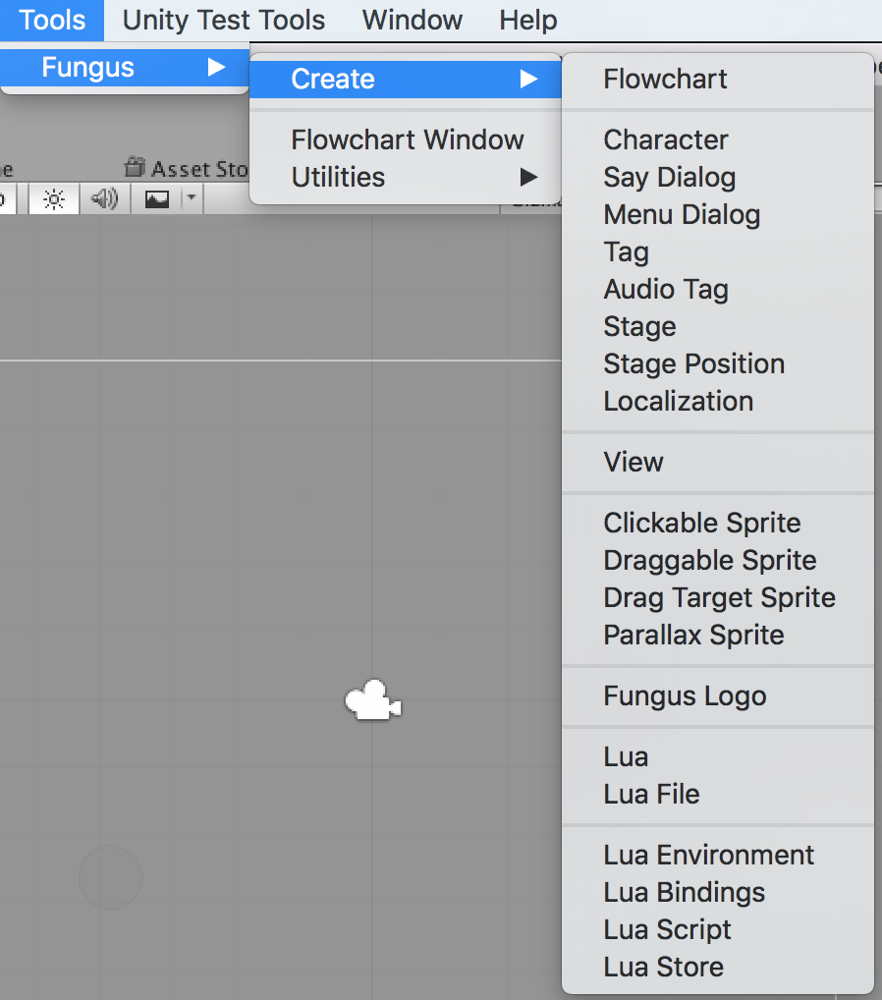

# The Create Menu

The easiest way to add Lua scripting to your scene is via the Tools > Fungus > Create menu. This allows you to quickly instantiate one of the Lua prefabs that comes with FungusLua. The FungusLua prefabs all begin with 'Lua'.

You can also access these prefabs from Fungus/Thirdparty/FungusLua/Resources/Prefabs.

# Lua Prefab

This prefab provides a complete Lua setup, including the [LuaEnvironment](lua_environment.md), [LuaUtils](lua_utils.md), [LuaBindings](lua_bindings.md) and [LuaScript](lua_script.md) components in a single game object. This is perfect when you want to quickly set up a single script with a few bindings. For more sophisticated scenarios it may be better to use these components in different game objects, e.g. one LuaEnvironment object, one LuaBindings object and multiple LuaScript objects that share the environment and bindings.

Note that by default the LuaBindings component will register its bindings with all LuaEnvironments in the scene. If you don't want this behaviour, deselect the 'All Environments' option.

# Lua File

This option creates a Lua file in the folder you select. In Unity, Lua files have to use the .txt extension so they will work properly as TextAssets and will open in the code editor. 

When you create a Lua file, add your Lua script to it in a text editor, and then select the file in the Lua File property of a LuaScript component to execute it. You can also use Lua's [module system](lua_script.md#lua-modules-and-require) and the require() function to include Lua code from other files. 

# Lua Environment Prefab

This prefab provides a [LuaEnvironment]((lua_environment.md)) component for executing Lua script, and the [LuaUtils](lua_utils.md) component which provides useful utilities for working with Lua, Unity and Fungus.

FungusLua will automatically create a default LuaEnvironment if none exists when the scene starts, so you really only need to create a Lua Environment in your scene when you want to customize the default environment setup (e.g. Adding a string table file or registering additional c# types).

# Lua Bindings Prefab

This prefab provides a [LuaBindings](lua_bindings.md) component which you can use to bind objects in your scene / project to Lua variables so they can be accessed from Lua script. You can have multiple Lua Bindings in a scene, or additively load in a scene which contains a Lua Bindings for objects in that scene. At startup, all loaded Lua Bindings register their bindings with every Lua Environment in the scene (unless the All Environments option is switched off).

If you want to make a prefab using Lua Bindings, all the bound objects must be children of the Lua Bindings prefab in the hierarchy so that Unity can maintain the object references correctly. This is a limitation of how Unity works.

# Lua Script Prefab

This prefab contains a [Lua Script](lua_script.md) component which you can use to execute Lua script, either typed in the inspector window or loaded via a text file. It also contains an Execute Handler component which supports executing the Lua Script when a Unity event occurs (e.g. start, update, on enter trigger, etc.)

# Lua Store Prefab

This prefab contains a [Lua Store](lua_store.md) component which you can use to persist Lua variables between scene loads.
