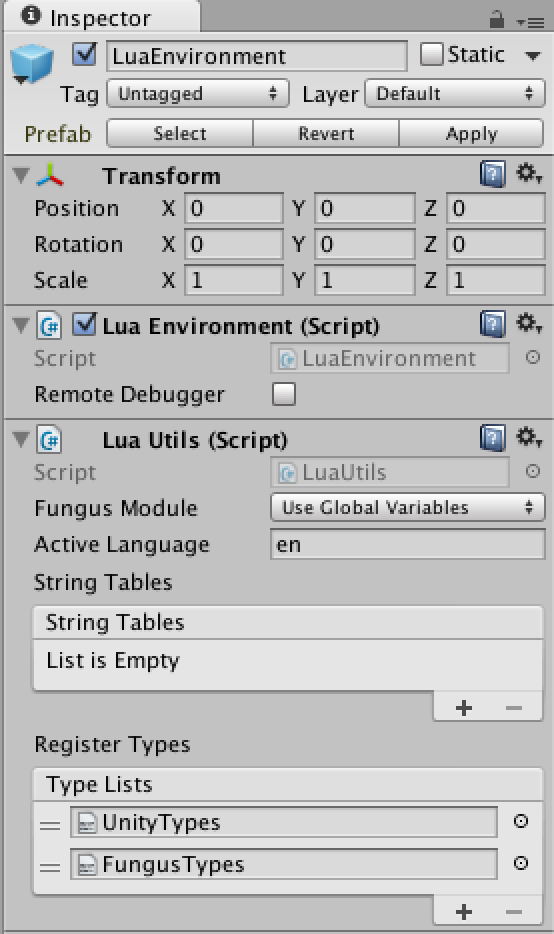

# LuaEnvironment

The LuaEnvironment component manages all the variables, functions, executing code, etc. for a single Lua context, and provides handy functions for loading and running Lua scripts.

In order to run Lua code there must be at least one LuaEnvironment component present in the scene. 

You can create one via (Tools > Fungus > Create > LuaEnvironment). You usually don't need to explicitly create a LuaEnvironment though because FungusLua will create one automatically if there isn't one in the scene at startup.

# Multiple Environments

You can use multiple LuaEnvironments in your scene to ’sandbox’ the variables, functions and executing code of independent sets of Lua scripts. If you do this, make sure to specify the appropriate LuaEnvironment when using LuaScript components, ExecuteLua commands, etc. or else they'll just use the first one they find in the scene.

# Remote Debugger

The 'Remote Debugger' option activates the built-in MoonSharp remote debugger tool. The application will halt execution on the first executed line of Lua code and open a MoonSharp debugger window in your browser. See the [MoonSharp documentation](http://www.moonsharp.org/debugger.html) for more information on using this debugger.
 
# LuaUtils

When you create a LuaEnvironment object via (Tools > Fungus > Create > LuaEnvironment), the created gameobject has another component called LuaUtils which adds many useful features to the basic LuaEnvironment setup. See the [Lua Utils](lua_utils.md) section for more info.

