Follow these steps to get up and started with Fungus quickly. Then learn more about what Fungus can do and how to do it from the other documentation pages and videos.

## Installing Unity
Download and install the latest version of Unity from the
[Unity3D.com]
website.

Note, the download page is usually located at:
[Unity3D.com/get-unity]

## Installing Fungus - from Unity Asset store
Follow these steps to quickly install Fungus for a Unity project via the Unity Asset Store:

1. Create a new Unity 2D project.

1. Open the Asset Store window.

1. Navigate to: ```Editor Extensions | Game Toolkis | Visual Novels``` (or search for Fungus!).
<br>

<br>
<br>

1. On the Fungus details page click the Import button,
<br>(the first time you download Fungus you'll be asked to agree to the MIT open source licence):
<br>

<br>
<br>


1. Choose to import all contents from this package.
<br>

<br>
<br>

You should now see a Fungus folder in your Project panel, containing both the Fungus flowcharting features themselves, as well as some sample scenes to get you started:
<br>


## Installing Fungus - from Fungus package
Follow these steps to quickly install Fungus for a Unity project:

1. Download the latest version of the Fungus unitypackage from the [FungusGames.com] website.

2. Create a new Unity 2D project.

3. Import the Fungus unitypackage by choosing menu: ``Assets | Import Package | Custom Package...``, and then navigating to your downloaded file location.
<br>

<br>
<br>

<br>
<br>

4. Choose to import all contents from this package.
<br>

<br>

You should now see a Fungus folder in your Project panel, containing both the Fungus flowcharting features themselves, as well as some sample scenes to get you started:
<br>


[Unity3D.com]: http://www.unity3d.com
[Unity3D.com/get-unity]: http://unity3d.com/get-unity
[FungusGames.com]: http://www.fungusgames.com

## Opening and docking the Flowchart window
You'll need the Fungus Flowchart window when working with Fungus. Open and dock this window somewhere handy by following these steps:

1. Choose menu: ``Tools | Fungus | Flowchart Window``
<br>

<br>
<br>

2. Drag-and-drop the Flowchart window to the location you wish to dock it:
<br>

<br>
<br>

3. The Flowchart window is now docked and part of your Unity window layout:
<br>


## Finding the example folders and scene files
Two folders are created when you install Fungus, the Fungus features themeslves (in folder 'Fungus') and a set of examples (in folder 'FungusExamples').

Examples include Drag and Drop, Sherlock and Fungus Town:
<br>
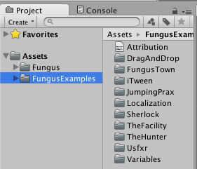
<br>

You can use the left-hand side of the Unity Project window to explore each example folder:
<br>
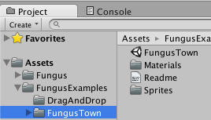
<br>

Alternatively, you can 'filter' the Project view to show all scenes (and no other files) by clicking the scene filter icon to the right of the search bar:
<br>
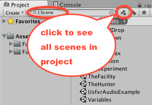
<br>

You can cancel the filter by clicking the 'x' in the search bar:
<br>
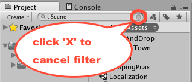
<br>

## Loading and playing the example scenes
To **load** an example scene, double click the desired example's scene object in the Projet window, and the scene should load. For example, this screenshot shows the scene and Flowchart windows when the DragAndDrop example scene has been loaded:
<br>
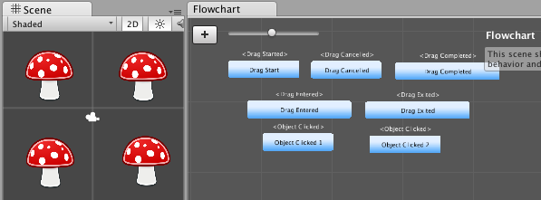
<br>

To **run** the currently loaded scene (i.e. to entery **Play-mode**), click the Unity 'play' triangle button at the center top of the Unity application window, and then do whatever makese sense in that scene (e..g click/type text/drag-and-drop objects etc.!):
<br>
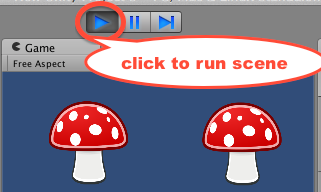
<br>

Note: you click the 'play' button a second time to end **Play-mode**.

## Changes made during playmode don't persist
As with all Unity projects, you can **change** the properties of gameObjects while a scene is running, but these changes are 'ephemeral' - they only last while the scene is running. As soon as you end play mode the properties of all objects in the Hierarchy will revert to those saved in the Scene file.

This makes it easy to 'tweak' values of objects in **Play-mode**, and then when the desired behaviour is achieved, those values can be set for the saved scene properties.

Values set when Unity is in **Edit-mode** will be saved when you saved your scene (``CTRL-S`` / ``Command-S``, or menu: ``File | Save Scene``).

## Change your preferences to highlight Play-mode
Sometimes we can forget we are in Unity **Play-mode**, and then make changes to Hierarchy gameObject values that are then 'fogotton' when we do stop playing the scene. A good way to avoid this problem is to to set a 'tint' to the Unity editor to make it visually very clear to us when we are in **Play-mode**. To add a tint to **Play-mode** do the following:

1. Open the Unity preferences dialog by choosing menu: ```File | Preferences ...```

2. Select the ```Colors``` preferences, and choose a light colored tint (we chose a light green in this case):
<br>

<br>
<br>

3. Close the dialog (changes are saved automatically).

4. When you next enter **Play-mode** you'll see most of the Unity Editor windows turn green (apart from the Game and Flowchart windows):
<br>
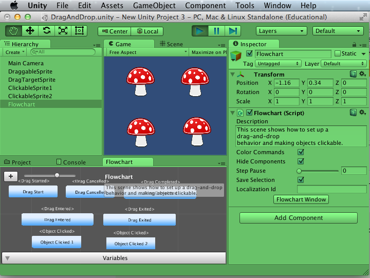
<br>

## Creating, naming and saving a new scene from scratch
To create a new scene in Unity do the following:

1. Choose menu: ```File | New Scene```

2. Note: if you have any unsaved changes for the current scene you need to either save or abandon them before a new scene can be created.

3. You should now have a shiny new scene, with a Hiearchy containing just one gameObject, a Main Camera. The new scene will have been give the default name "Untitled", which you can see in the title of the Application window:
<br>
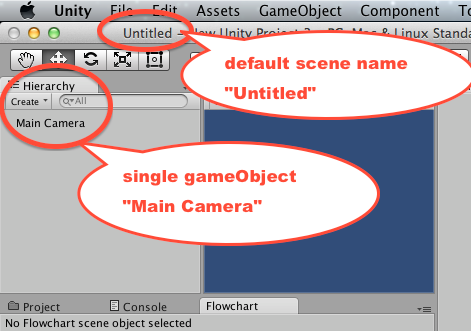
<br>
<br>

4. Good practice is to save your scene (in the right place, with the right name), before creating your work in the scene. Let's save this scene in the root of our project "Assets" folder, naming it "demo1". First choose menu: ```File | Save Scene As...```

5. Choose the location and name (we'll choose folders "Assets" and scene name "demo1"):
<br>
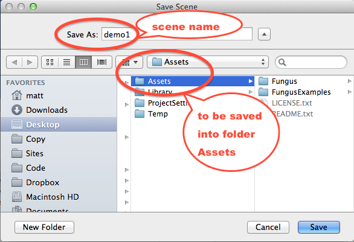
<br>
<br>

6. Once you have successfully saved the scene you should now see the new scene file "demo1" in your Assets folder in the Project window, and you should also see in the Application window title that you are currently editing the scene named "demo1":
<br>
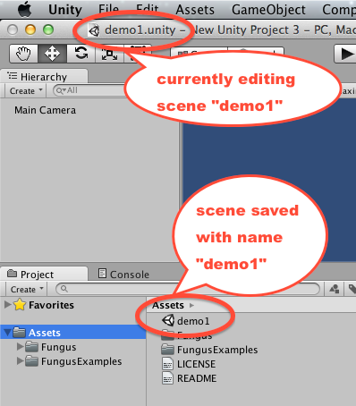
<br>

## Menu: Tools | Fungus
The core Fungus operations are available from the Unith ```Tools``` menu.

Choose menu: ```Tools | Fungus``` to see the options availble:
<br>
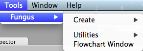
<br>

As can be seen, there are 2 submenus, ```Create``` and ```Utilities```, plus the ```Flowchart Window``` action (which reveals the window if already open, or opens a new window if the Flowchart window was not previously opened).

### Menu: Tools | Fungus | Create
The Fungus Tools ```Create``` submenu offers the following actions:
<br>
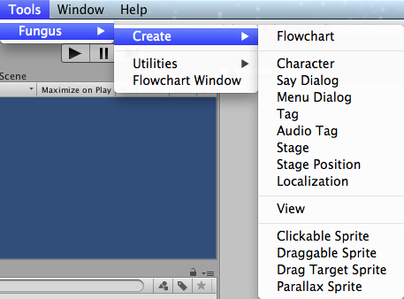
<br>


### Menu: Tools |  Fungus | Utilities
The Fungus Tools ```Utilties``` submenu offers the following actions:
<br>

<br>

## Create a Flowchart
To create a Fungus Flowchart do the following:

1. Choose menu: ```Tools | Fungus | Create Flowchart```
<br>

<br>
<br>

2. A new **Flowchart** gameObject should appear in the Hierarchy window.
<br>

<br>
<br>

3. Select the **Flowchart** gameObject in the Hierarchy window, and you'll see the **Flowchart's** properties in the Inspector Window:
<br>
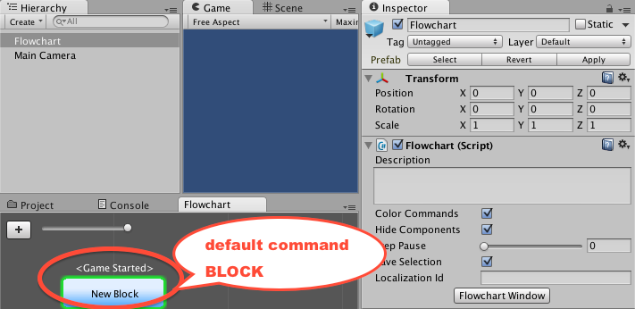
<br>
<br>

4. If you have not already displayed the Flowchart Window, you can do so by clicking the Flowchart Window button in the Inspector.

5. As you can see, when a new Flowchat is created a single command Block named "New Block" is automatically created, with the Event handler "Game Started" (so it will start executing Fungus commands as soon as the scene goes into **Play Mode**).

## Flowchart Block property viewing and editing
Let's change the name of the default command Block of a new Flowchart in the Flowchart window to "hello". Do the following:

1. Create a new Fungus Flowchart (if you haven't already done so).

2. Click to select the Block in the Flowchart window (when multiple blocks are present, the selected one gets a green highlight border).

3. In the Inspector change the text for the Block Name property to "hello". You should see the Block name change in the Flowchart window:
<br>

<br>

## Add a Say command
To add a "Say" command to a Block do the following:

1. (setup) Create a new scene, add a Fungus Flowchart to the scene.

1. Ensure the Block is selected, and you can see its properties in the Inspector, and ensure the name of the Block is "hello".

2. Click the Plus button in the bottom half of the Inspector window, to add a new Command to the Block's properties:
<br>
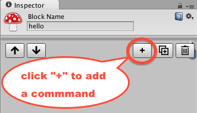
<br>
<br>

3. Choose menu: ```Narrative | Say```:
<br>
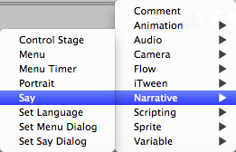
<br>
<br>

4. Since this Block only has one Command, that command is automatically selected (shown with a green highlght).

5. In the "Story Text" textbox in the bottom half of the Inspector window type in "hello Fugus world":
<br>
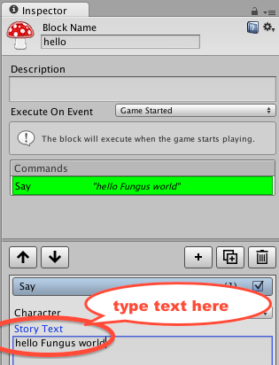
<br>
<br>

6. Run the scene, and see Fungus create a dialog window, and output the text contents of your Say command:
<br>

<br>
<br>


[Unity3D.com]: http://www.unity3d.com
[Unity3D.com/get-unity]: http://unity3d.com/get-unity
[FungusGames.com]: http://www.fungusgames.com
